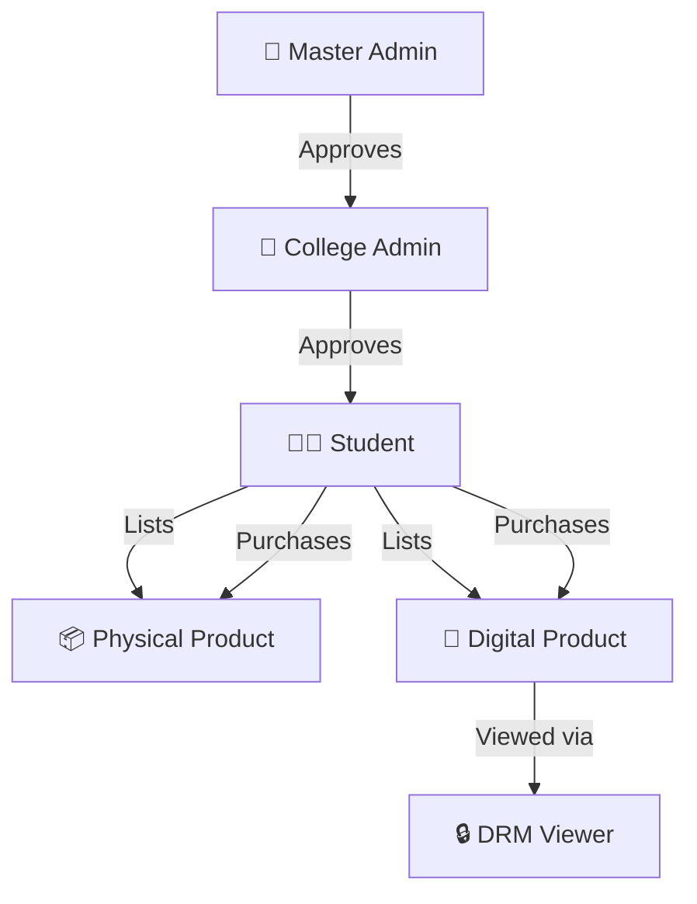

<div align="center">


<br/><br/>

# 🎓 CampusConnect

### *A College-Exclusive Peer-to-Peer Marketplace*

**Buy & sell refurbished goods and DRM-protected digital study materials — exclusively within your college community.**

<br/>

[🌐 **Live Demo**](https://frontend-two-gray-85.vercel.app) &nbsp;·&nbsp; [📋 Technical Spec](./production_artifacts/Technical_Specification.md) &nbsp;·&nbsp; [🐛 Report Bug](https://github.com/Jevin2005/project-CampuseConnect/issues) &nbsp;·&nbsp; [✨ Request Feature](https://github.com/Jevin2005/project-CampuseConnect/issues)

</div>

---

## 📖 Table of Contents

- [About the Project](#-about-the-project)
- [Key Features](#-key-features)
- [Tech Stack](#-tech-stack)
- [System Architecture](#-system-architecture)
- [User Roles](#-user-roles)
- [Pages & Screens](#-pages--screens)
- [DRM Protection](#-drm--content-protection)
- [Design System](#-design-system)
- [Getting Started](#-getting-started)
- [Project Structure](#-project-structure)
- [Deployment](#-deployment)
- [Roadmap](#-roadmap)
- [License](#-license)

---

## 🚀 About the Project

**CampusConnect** is a multi-tenant, college-exclusive marketplace platform that enables verified students to:

- 📦 **Buy & sell refurbished physical products** — books, electronics, furniture, and more
- 📚 **Monetize digital study materials** — notes (PDF), video lectures, with full DRM protection
- 🔒 **Stay within their college's market** — strict tenant isolation ensures students only interact with peers from the same institution

The platform operates on a **three-tier role model**:

```
Master Admin (Platform Team)
        │
        ▼
College Admin (Per-College)
        │
        ▼
   Students (Buyers & Sellers)
```

> Each college is a completely isolated marketplace tenant. A student from IIT cannot see listings from NIT — total privacy and community focus.

---

## ✨ Key Features

### 👨‍🎓 Student Panel
| Feature | Description |
|---------|-------------|
| 🔐 **Verified Registration** | Sign up with college enrollment email — triggers admin approval |
| 🛍️ **Marketplace Access** | Browse, filter, and buy products within your college only |
| 📦 **Sell Physical Items** | List second-hand goods with images, description, and price |
| 📄 **Sell Digital Content** | Upload PDF notes / video lectures with DRM auto-applied |
| 🎬 **Protected Viewer** | Read/watch purchased content in-browser — no download, no screenshots |
| 💬 **In-App Messaging** | Chat with sellers for physical product inquiries |
| ⭐ **Ratings & Reviews** | Rate sellers and products after purchase |
| 👤 **Profile Dashboard** | Track listings, purchases, wallet balance, and transactions |

### 🏫 College Admin Panel
| Feature | Description |
|---------|-------------|
| ✅ **Student Approval** | Approve or reject student registration requests |
| 🛡️ **Product Moderation** | Remove inappropriate or fraudulent listings |
| 📢 **Ad Management** | Create ads for own college or pay to run cross-college campaigns |
| 📣 **Announcements** | Post college-wide notices to all students |
| 📊 **College Dashboard** | Revenue, active users, product counts, flagged content |

### 👑 Master Admin Panel
| Feature | Description |
|---------|-------------|
| 🏫 **College Approval** | Review and approve college admin registration requests |
| 🌐 **Global Dashboard** | Platform-wide revenue, profit, fees, and active colleges |
| 🔍 **College Analytics** | Drill into any college — students, listings, revenue |
| ⚙️ **Fee Configuration** | Set listing, digital product, and ad fees globally or per college |
| 🚫 **User Management** | Suspend or ban any student or admin across the platform |
| 📊 **Financial Reports** | Export revenue and profit reports (CSV / PDF) |

---

## 🛠️ Tech Stack

### Frontend (Current — Deployed)
| Technology | Version | Purpose |
|-----------|---------|---------|
| **Next.js** | 16.2.4 | App Router, SSR, routing |
| **TypeScript** | 5.x | Type safety |
| **Tailwind CSS** | 4.x | Utility-first styling |
| **Framer Motion** | 12.x | Animations & transitions |
| **Lucide React** | 1.x | Icon library |

### Planned Backend Stack
| Technology | Purpose |
|-----------|---------|
| **Node.js + Express.js** | REST API server |
| **PostgreSQL + Prisma** | Database with multi-tenant isolation |
| **Redis** | Session store, rate limiting, caching |
| **AWS S3 / Cloudflare R2** | Media storage with signed URLs |
| **Socket.IO** | Real-time messaging |
| **Razorpay** | Payment gateway (India-first, INR) |
| **JWT + Nodemailer** | Auth & email verification |
| **PDF.js + HLS** | DRM content viewers |

---

## 🏗️ System Architecture

```
┌─────────────────────────────────────────────────────────────────┐
│                        CLIENT LAYER                             │
│  ┌─────────────┐  ┌──────────────────┐  ┌────────────────────┐ │
│  │ Student App │  │ College Admin App │  │ Master Admin App   │ │
│  │  (Blue 💙)  │  │   (Green 💚)      │  │   (Gold 💛)        │ │
│  └──────┬──────┘  └────────┬─────────┘  └─────────┬──────────┘ │
└─────────┼──────────────────┼────────────────────────┼───────────┘
          │  HTTPS / REST    │                        │
┌─────────▼──────────────────▼────────────────────────▼───────────┐
│              API GATEWAY  (Nginx + Rate Limiter)                 │
│  ┌─────────────────────────────────────────────────────────────┐ │
│  │             Express.js REST API (Node.js + TS)              │ │
│  │  /auth  /students  /products  /admins  /master  /payments   │ │
│  └──────────────────┬──────────────────────────────────────────┘ │
└─────────────────────┼───────────────────────────────────────────┘
          ┌───────────┼─────────────┬─────────────────────┐
          ▼           ▼             ▼                     ▼
    ┌──────────┐ ┌─────────┐ ┌──────────┐        ┌──────────────┐
    │PostgreSQL│ │  Redis  │ │  AWS S3  │        │  Socket.IO   │
    │(Prisma)  │ │(Cache)  │ │(Media)   │        │  (Chat/WS)   │
    └──────────┘ └─────────┘ └──────────┘        └──────────────┘
```

### Multi-Tenancy Model
Every resource (students, products, orders, ads) carries a `college_id` foreign key. API middleware extracts the `college_id` from the JWT on every request and scopes all database queries accordingly — ensuring **complete data isolation** between colleges.

---

## 👥 User Roles



---

## 📱 Pages & Screens

### Public Pages
| Route | Description |
|-------|-------------|
| `/` | Landing page with hero, features, CTA |
| `/how-it-works` | Platform explainer |
| `/login` | Student login |
| `/verify-otp` | Email OTP verification |
| `/pending-approval` | Awaiting admin approval screen |

### Student Marketplace (`/marketplace/*`)
| Route | Screen |
|-------|--------|
| `/marketplace` | Main marketplace browse |
| `/marketplace/sell` | List new item (physical or digital) |
| `/marketplace/listings` | My listed items |
| `/marketplace/purchases` | My purchase history |
| `/marketplace/profile` | Student profile & stats |
| `/marketplace/product/[id]` | Product detail page |
| `/marketplace/viewer/pdf` | DRM PDF viewer |
| `/marketplace/viewer/video` | DRM video player |

### College Admin Panel (`/admin/*`)
| Route | Screen |
|-------|--------|
| `/admin/login` | Admin login (green theme) |
| `/admin/register` | 2-step registration form |
| `/admin/dashboard` | Stats, activity, quick actions |
| `/admin/requests` | Student approval queue |
| `/admin/products` | Product moderation table |
| `/admin/advertisements` | Ad creation & management |
| `/admin/revenue` | Revenue charts & transactions |
| `/admin/settings` | Profile, security, preferences |

### Master Admin Panel (`/master/*`)
| Route | Screen |
|-------|--------|
| `/master/login` | Master login (gold theme) |
| `/master/dashboard` | Global platform analytics |
| `/master/requests` | College admin approval queue |
| `/master/colleges` | All registered colleges |

---

## 🔒 DRM & Content Protection

CampusConnect implements robust IP protection for digital content:

### PDF Protection
- ❌ Right-click disabled
- ❌ Ctrl+S / Ctrl+P / Ctrl+A blocked
- ❌ DevTools print blocked
- 🔐 Served via **private S3 signed URLs** (15-min TTL)
- 💧 Seller's username **dynamically watermarked** on every page canvas via PDF.js
- 📄 Pages loaded one-at-a-time (no bulk prefetch)

### Video Protection
- 🎥 Served as **HLS streams** (`.m3u8`) — not downloadable mp4
- 💧 Canvas overlay watermark with seller's username
- ⏸️ Auto-pauses on tab switch / screen capture detection
- 🚫 `download` attribute disabled; right-click blocked

---

## 🎨 Design System

CampusConnect uses a **premium dark-mode design system** consistently applied across all 3 panels:

### Color Palette
```css
--bg-primary:    #0A0E1A   /* Main background          */
--bg-card:       #111827   /* Card background           */
--accent-blue:   #4F8EF7   /* Student panel             */
--accent-green:  #10B981   /* College Admin panel       */
--accent-gold:   #F7C948   /* Master Admin panel        */
--accent-purple: #7C3AED   /* Digital products / DRM   */
--accent-red:    #EF4444   /* Danger / Delete / Reject  */
```

### Typography
- **Headings**: `Sora` — bold, modern, distinctive
- **Body**: `DM Sans` — clean, readable, professional
- **Codes / IDs**: `JetBrains Mono` — OTP inputs, college codes, IDs

### Panel Themes
| Panel | Accent Color | Use |
|-------|-------------|-----|
| 💙 Student | `#4F8EF7` Blue | Buttons, nav highlights, glows |
| 💚 College Admin | `#10B981` Green | Buttons, nav highlights, glows |
| 💛 Master Admin | `#F7C948` Gold | Buttons, nav highlights, glows |

---

## 🏁 Getting Started

### Prerequisites
- **Node.js** v18+ 
- **npm** v9+

### Installation

```bash
# 1. Clone the repository
git clone https://github.com/Jevin2005/project-CampuseConnect.git
cd project-CampuseConnect

# 2. Navigate to frontend
cd frontend

# 3. Install dependencies
npm install

# 4. Start development server
npm run dev
```

Open [http://localhost:3000](http://localhost:3000) in your browser.

### Build for Production

```bash
npm run build
npm run start
```

---

## 📁 Project Structure

```
project-CampuseConnect/
│
├── frontend/                          ← Next.js 16 App (App Router + TypeScript)
│   ├── app/
│   │   ├── page.tsx                   ← Landing Page (/)
│   │   ├── layout.tsx                 ← Root layout
│   │   ├── globals.css                ← Global CSS + design tokens
│   │   ├── login/                     ← Student login
│   │   ├── verify-otp/                ← OTP verification
│   │   ├── pending-approval/          ← Awaiting approval
│   │   ├── how-it-works/              ← Explainer page
│   │   ├── marketplace/               ← Student marketplace (8 pages)
│   │   ├── admin/                     ← College Admin panel (8 pages)
│   │   └── master/                    ← Master Admin panel (4 pages)
│   │
│   ├── components/                    ← Reusable UI components
│   │   ├── ui/                        ← Base design system (Button, Card, Badge...)
│   │   ├── layout/                    ← Navbars, Sidebars, Footer
│   │   ├── student/                   ← Student-specific components
│   │   ├── admin/                     ← Admin-specific components
│   │   └── master/                    ← Master admin components
│   │
│   ├── next.config.ts
│   ├── tailwind.config.ts
│   └── package.json
│
├── production_artifacts/
│   ├── Technical_Specification.md     ← Full system specification
│   └── Admin_Panel_Progress.md        ← Build progress tracker
│
└── README.md
```

---

## 🚀 Deployment

The frontend is deployed on **Vercel** (free tier) with zero configuration:

| | |
|---|---|
| 🌐 **Live URL** | https://frontend-two-gray-85.vercel.app |
| 🔍 **Inspector** | https://vercel.com/jevin2005s-projects/frontend |

### Deploy your own fork

```bash
# Install Vercel CLI
npm install -g vercel

# Deploy to production
vercel --prod
```

Or connect your GitHub repo at [vercel.com](https://vercel.com) for automatic deploys on every push.

---

## 🗺️ Roadmap

### ✅ Phase 1 — Frontend Prototype (Complete)
- [x] Landing page & public pages
- [x] Student marketplace UI (13 screens)
- [x] College Admin panel (8 screens)
- [x] Master Admin panel (4 screens)
- [x] Consistent dark-mode design system
- [x] Deployed to Vercel

### 🔄 Phase 2 — Backend Integration (Planned)
- [ ] Node.js + Express REST API
- [ ] PostgreSQL database with Prisma ORM
- [ ] JWT authentication (all 3 roles)
- [ ] Multi-tenant college isolation
- [ ] Email verification (Nodemailer + SendGrid)

### 🔮 Phase 3 — Advanced Features (Planned)
- [ ] AWS S3 file storage + signed URLs
- [ ] Razorpay payment gateway
- [ ] DRM PDF viewer (PDF.js + canvas watermark)
- [ ] DRM video player (HLS + canvas overlay)
- [ ] Real-time chat (Socket.IO)
- [ ] Redis caching & rate limiting
- [ ] CSV/PDF financial report export

---

## 👤 Author

**Jevin** — [@Jevin2005](https://github.com/Jevin2005)

---

## 📄 License

Distributed under the **MIT License**. See [`LICENSE`](LICENSE) for more information.

---

<div align="center">

**⭐ Star this repo if you found it helpful!**

Made with ❤️ for college students everywhere

</div>
