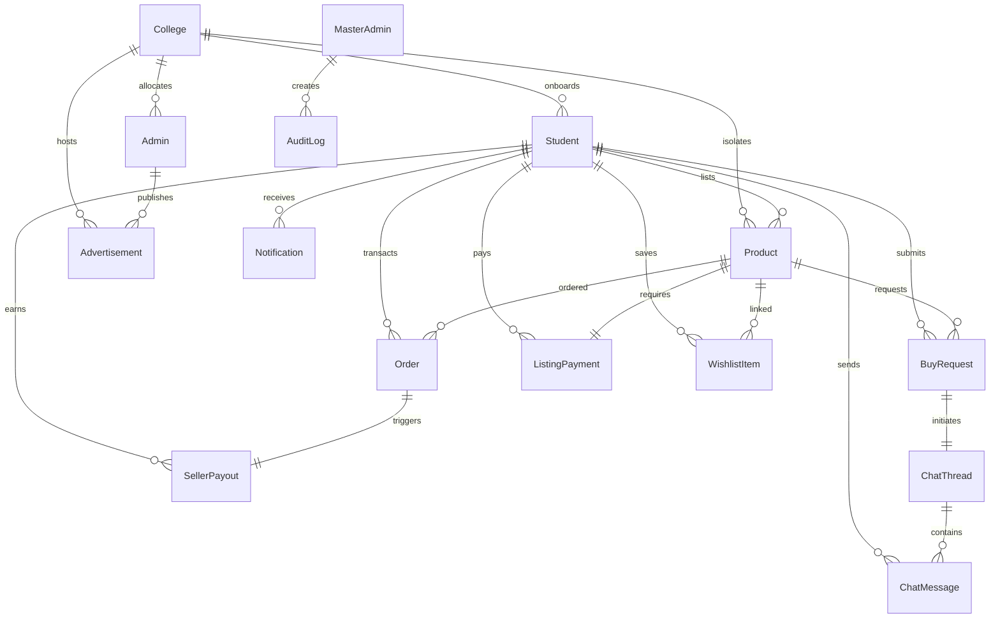

<div align="center">


<br/>

# 🎓 CampusConnect

### *The Secure, Multi-Tenant Peer-to-Peer Commerce & DRM Platform for Universities*

**An enterprise-grade, high-performance SaaS marketplace allowing verified university students to buy, sell, and securely monetize digital study materials and physical resources.**

<br/>

[🌐 **Live Production**](https://frontend-two-gray-85.vercel.app) &nbsp;·&nbsp; [📋 Technical Architecture](./production_artifacts/Project_Overview.md) &nbsp;·&nbsp; [⚡ System Specifications](./production_artifacts/Project_Overview.md)

</div>

---

## 🚀 Executive Summary

**CampusConnect** is a proprietary multi-tenant peer-to-peer SaaS platform engineered to solve the safety and copyright leakage problems inherent in university-level commerce. 

Unlike generic classified sites, CampusConnect provides:
* 🔒 **Cryptographically Isolated Multi-Tenancy**: Complete network and database separation at the institution level. Students can only trade and converse with authenticated peers within their specific university domain.
* 🛡️ **Proprietary DRM Engine**: A custom-built security pipeline that renders digital intellectual property (PDFs, lectures, documents) on a secured HTML5 Canvas—preventing raw file access, print commands, downloads, and screen captures.
* 💳 **Built-in Monetization & Escrow**: An integrated multi-tier payment infrastructure supporting flat listing fees and buyer platform fees, backed by structured seller payout ledgers and safety cooling periods.

---

## ✨ Core Product Features

### 👨‍🎓 Student Panel & DRM Security Engine (Blue 💙)

| Feature | Technical Implementation | Core Functionality |
| :--- | :--- | :--- |
| **Domain-Verified Onboarding** | Dynamic regex check against college email registries | Verifies student matching domains before granting access to isolated campus. |
| **Secure Canvas Document Reader** | Dynamic in-memory PDF/video projection directly to HTML5 canvas | Neutralizes URL sniffing, DevTools inspection, copy-paste, and standard save options. |
| **Active Screen Capture Defense** | Browser window blur & focus tracking event handlers | Blackouts reader screen instantly if screen-capture tools or Snip is opened. |
| **Hardware & Clipboard Interceptor** | PrintScreen listener & clipboard buffer sanitizer | Prevents Ctrl+C, Ctrl+P, Ctrl+S; overwrites OS clipboard with `🔒` on PrintScreen. |
| **Dynamic Watermark Renderer** | Multi-row diagonal overlays of user metadata (IP, time, email) | Decouples mobile camera leakage by tagging the buyer's credentials to the stream. |
| **Interactive Negotiation Inbox** | Real-time bi-directional messaging with Socket.io | Automates negotiation chats, transaction statuses, and updates. |

### 🏫 College Admin Panel & Local Ad Manager (Green 💚)

| Feature | Technical Implementation | Core Functionality |
| :--- | :--- | :--- |
| **Student Access Moderation** | Interactive vetting queue & registration status switches | Vets enrollment details, approves profiles, and manages student status controls. |
| **Listing Control Board** | Flag reviews and approval state toggles via DB operations | Approves digital listing catalog updates and flags questionable listings. |
| **Campus Revenue Dashboard** | Statistical tracking metrics with localized aggregations | Charts transaction frequency, listing fees gathered, and total platform cut. |
| **Self-Serve Ad Placements** | Campaign scheduling interface & media upload handles | Places banner/sponsored cards within target college and tracks views/clicks/CTR. |

### 👑 Master Admin Panel & Global Settings (Gold 💛)

| Feature | Technical Implementation | Core Functionality |
| :--- | :--- | :--- |
| **Tenant Provisioning** | Dynamic institution onboarding & domain config forms | Provisions new colleges, defines valid email domains, and generates keys. |
| **Platform Revenue Config** | Dynamic settings overrides adjusting global fee ratios | Modifies seller upload costs, checkout surcharges, and release lockouts. |
| **Compliance Audit Logs** | Comprehensive audit registers matching logs to admin keys | Audits master actions, tracks configuration revisions, and manages system bans. |

### ⚙️ Core Fintech & Infrastructure Engine (Purple 💜)

| Feature | Technical Implementation | Core Functionality |
| :--- | :--- | :--- |
| **Escrow Payout Ledger** | Automatic split checkout fees + Razorpay webhook logic | Splits payments between seller cuts and platform margins; locks funds under escrow. |
| **Automated Escrow Releases** | Time checks against `releaseAfter` constraints | Auto-releases ledger assets after the dispute window (e.g. 7 days). |
| **Dynamic Physical Pricing** | JSON price-tier mapping configuration | Calculates listing fees dynamically based on item prices (e.g. 5% cut). |
| **Double-Guard Session Security** | JWT (15-min) + secure HTTP-only Refresh Cookies (7-day) | Rotates tokens; integrates with Redis cache database to support instant global logouts. |
| **Multi-Format Asset Handling** | Multer buffer uploads with Cloudflare R2 security | Uploads images, videos, and PDFs; delivers them via 15-minute TTL signed URLs. |
| **Live Aggregates Engine** | PostgreSQL database aggregates (`groupBy` on Prisma models) | Evaluates sales figures, catalog distributions, and top merchants. |


---

## 🏗️ Technical Architecture

```
                                   +--------------------------------------------------------+
                                   |                      CLIENT LAYER                      |
                                   |                                                        |
                                   |   +----------------+  +----------------+  +--------+   |
                                   |   |  Student App   |  | Col Admin App  |  | Master |   |
                                   |   |   (Blue 💙)    |  |   (Green 💚)   |  | (Gold) |   |
                                   |   +-------+--------+  +-------+--------+  +----+---+   |
                                   +-----------|-------------------|----------------|-------+
                                               | HTTPS             |                |
                                               |                   v                |
                                   +-----------v------------------------------------v-------+
                                   |                 NGINX GATEWAY / RATE LIMITER           |
                                   +-------------------------------|------------------------+
                                                                   v
                                   +--------------------------------------------------------+
                                   |             EXPRESS.JS REST API BACKEND SERVER         |
                                   |                                                        |
                                   |   /api/auth   /api/marketplace   /api/admin  /api/etc  |
                                   +------|-------------|-------------|-------------|-------+
                                          |             |             |             |
                         +---------------+             |             |             +---------------+
                         |                             v             v                             |
                         v                       +-----------+ +-----------+                       v
                  +------------+                 | Cloudflare| |  Socket.  |                +-------------+
                  | PostgreSQL |                 |   R2 / S3 | |   IO Web  |                |    Redis    |
                  |  (Prisma)  |                 |  (Private)| |  Sockets  |                | (Token ver/ |
                  +------------+                 +-----------+ +-----------+                |   Cache)    |
                                                                                            +-------------+
```

### Key Technical Specs
* **Frontend**: Next.js `16.2.4` (App Router, Turbopack) built with TypeScript `5.x`, Zustand `5.0.x` persistent stores, and Tailwind CSS `4.x`.
* **Backend**: Asynchronous Node.js & Express.js REST API with Redis `5.10.x` handling active token version checks, API rate limiting, and temporary state caches.
* **Database & ORM**: Prisma `6.19.x` powering PostgreSQL database schemas with multi-tenant key index designs.
* **Media & Assets**: Secured Cloudflare R2 object storage utilizing short-lived (15-min TTL) presigned URLs for media security.
* **Real-Time Communication**: Socket.io for instantaneous student negotiation threads.

---

## 🗄️ Multi-Tenant Domain Schema

Every resource maps to a specific college instance to guarantee database level multi-tenancy. This ensures that student accounts, chat threads, listings, and local advertisements remain isolated within their own campus boundaries.



### Database Entity Architecture:
* **`College`**: The primary tenant model. Scopes all listings, student registrations, admin managers, and localized ad campaigns by matching email domains (e.g., `@columbia.edu`).
* **`Student` & `Admin`**: Role-isolated user tables. Admins moderate content locally and publish advertising campaigns. Students lists goods and trade peer-to-peer. Both feature token version tracking to handle forced global sign-out checks.
* **`Product` & `ListingPayment`**: Items categorized as physical or digital. Digital listings require verification via a `ListingPayment` order using Razorpay before showing up in local searches.
* **`BuyRequest`, `ChatThread` & `ChatMessage`**: P2P communication workflow. Triggering a request automatically instantiates a `ChatThread` room synchronized over Socket.io, persisting messaging histories locally.
* **`Order` & `SellerPayout`**: Purchases split platform transaction commissions. Digital sales trigger a `SellerPayout` record on a temporary lock state, releasing net earnings after the configuration cooling period.
* **`WishlistItem` & `Notification`**: Personalization features. Tracks individual student saved lists and broadcasts instant system updates (listings approved, chats received) to users.
* **`Advertisement`**: Managed by local college admins to broadcast internal student notifications, banner listings, or cross-tenant campaigns.
* **`AuditLog`**: Dedicated ledger tracking Master Admin security controls, parameter changes, and user bans.


---


## 👥 Co-Founders & Core Engineers

* **Jevin** — Co-Founder & Lead Engineer — [@Jevin2005](https://github.com/Jevin2005)
* **Varun** — Co-Founder & Lead Architect

---

## 📄 License

Distributed under the **MIT License**. See `LICENSE` for details.
