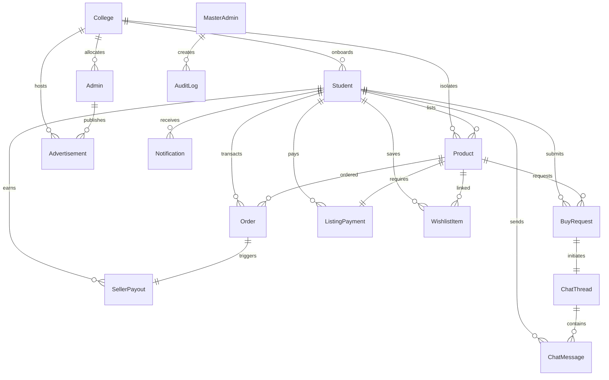

<div align="center">


<br/>

# 🎓 CampusConnect

### *The Secure, Multi-Tenant Peer-to-Peer Commerce & DRM Platform for Universities*

**An enterprise-grade, high-performance SaaS marketplace allowing verified university students to buy, sell, and securely monetize digital study materials and physical resources.**

<br/>

[🌐 **Live Production**](https://frontend-two-gray-85.vercel.app) &nbsp;·&nbsp; [📋 Technical Architecture](./production_artifacts/Project_Overview.md) &nbsp;·&nbsp; [⚡ System Specifications](./production_artifacts/Project_Overview.md)

</div>

---

## 🚀 Executive Summary

**CampusConnect** is a proprietary multi-tenant peer-to-peer SaaS platform engineered to solve the safety and copyright leakage problems inherent in university-level commerce. 

Unlike generic classified sites, CampusConnect provides:
* 🔒 **Cryptographically Isolated Multi-Tenancy**: Complete network and database separation at the institution level. Students can only trade and converse with authenticated peers within their specific university domain.
* 🛡️ **Proprietary DRM Engine**: A custom-built security pipeline that renders digital intellectual property (PDFs, lectures, documents) on a secured HTML5 Canvas—preventing raw file access, print commands, downloads, and screen captures.
* 💳 **Built-in Monetization & Escrow**: An integrated multi-tier payment infrastructure supporting flat listing fees and buyer platform fees, backed by structured seller payout ledgers and safety cooling periods.

---

## ✨ Core Product Features

### 👨‍🎓 Student Panel & DRM Security Engine (Blue 💙)

| Feature | Technical Implementation | Core Functionality |
| :--- | :--- | :--- |
| **Domain-Verified Onboarding** | Dynamic regex check against college email registries | Verifies student matching domains before granting access to isolated campus. |
| **Secure Canvas Document Reader** | Dynamic in-memory PDF/video projection directly to HTML5 canvas | Neutralizes URL sniffing, DevTools inspection, copy-paste, and standard save options. |
| **Active Screen Capture Defense** | Browser window blur & focus tracking event handlers | Blackouts reader screen instantly if screen-capture tools or Snip is opened. |
| **Hardware & Clipboard Interceptor** | PrintScreen listener & clipboard buffer sanitizer | Prevents Ctrl+C, Ctrl+P, Ctrl+S; overwrites OS clipboard with `🔒` on PrintScreen. |
| **Dynamic Watermark Renderer** | Multi-row diagonal overlays of user metadata (IP, time, email) | Decouples mobile camera leakage by tagging the buyer's credentials to the stream. |
| **Interactive Negotiation Inbox** | Real-time bi-directional messaging with Socket.io | Automates negotiation chats, transaction statuses, and updates. |

### 🏫 College Admin Panel & Local Ad Manager (Green 💚)

| Feature | Technical Implementation | Core Functionality |
| :--- | :--- | :--- |
| **Student Access Moderation** | Interactive vetting queue & registration status switches | Vets enrollment details, approves profiles, and manages student status controls. |
| **Listing Control Board** | Flag reviews and approval state toggles via DB operations | Approves digital listing catalog updates and flags questionable listings. |
| **Campus Revenue Dashboard** | Statistical tracking metrics with localized aggregations | Charts transaction frequency, listing fees gathered, and total platform cut. |
| **Self-Serve Ad Placements** | Campaign scheduling interface & media upload handles | Places banner/sponsored cards within target college and tracks views/clicks/CTR. |

### 👑 Master Admin Panel & Global Settings (Gold 💛)

| Feature | Technical Implementation | Core Functionality |
| :--- | :--- | :--- |
| **Tenant Provisioning** | Dynamic institution onboarding & domain config forms | Provisions new colleges, defines valid email domains, and generates keys. |
| **Platform Revenue Config** | Dynamic settings overrides adjusting global fee ratios | Modifies seller upload costs, checkout surcharges, and release lockouts. |
| **Compliance Audit Logs** | Comprehensive audit registers matching logs to admin keys | Audits master actions, tracks configuration revisions, and manages system bans. |

### ⚙️ Core Fintech & Infrastructure Engine (Purple 💜)

| Feature | Technical Implementation | Core Functionality |
| :--- | :--- | :--- |
| **Escrow Payout Ledger** | Automatic split checkout fees + Razorpay webhook logic | Splits payments between seller cuts and platform margins; locks funds under escrow. |
| **Automated Escrow Releases** | Time checks against `releaseAfter` constraints | Auto-releases ledger assets after the dispute window (e.g. 7 days). |
| **Dynamic Physical Pricing** | JSON price-tier mapping configuration | Calculates listing fees dynamically based on item prices (e.g. 5% cut). |
| **Double-Guard Session Security** | JWT (15-min) + secure HTTP-only Refresh Cookies (7-day) | Rotates tokens; integrates with Redis cache database to support instant global logouts. |
| **Multi-Format Asset Handling** | Multer buffer uploads with Cloudflare R2 security | Uploads images, videos, and PDFs; delivers them via 15-minute TTL signed URLs. |
| **Live Aggregates Engine** | PostgreSQL database aggregates (`groupBy` on Prisma models) | Evaluates sales figures, catalog distributions, and top merchants. |


---

## 🏗️ Technical Architecture

```
                                   +--------------------------------------------------------+
                                   |                      CLIENT LAYER                      |
                                   |                                                        |
                                   |   +----------------+  +----------------+  +--------+   |
                                   |   |  Student App   |  | Col Admin App  |  | Master |   |
                                   |   |   (Blue 💙)    |  |   (Green 💚)   |  | (Gold) |   |
                                   |   +-------+--------+  +-------+--------+  +----+---+   |
                                   +-----------|-------------------|----------------|-------+
                                               | HTTPS             |                |
                                               |                   v                |
                                   +-----------v------------------------------------v-------+
                                   |                 NGINX GATEWAY / RATE LIMITER           |
                                   +-------------------------------|------------------------+
                                                                   v
                                   +--------------------------------------------------------+
                                   |             EXPRESS.JS REST API BACKEND SERVER         |
                                   |                                                        |
                                   |   /api/auth   /api/marketplace   /api/admin  /api/etc  |
                                   +------|-------------|-------------|-------------|-------+
                                          |             |             |             |
                         +---------------+             |             |             +---------------+
                         |                             v             v                             |
                         v                       +-----------+ +-----------+                       v
                  +------------+                 | Cloudflare| |  Socket.  |                +-------------+
                  | PostgreSQL |                 |   R2 / S3 | |   IO Web  |                |    Redis    |
                  |  (Prisma)  |                 |  (Private)| |  Sockets  |                | (Token ver/ |
                  +------------+                 +-----------+ +-----------+                |   Cache)    |
                                                                                            +-------------+
```

### Key Technical Specs
* **Frontend**: Next.js `16.2.4` (App Router, Turbopack) built with TypeScript `5.x`, Zustand `5.0.x` persistent stores, and Tailwind CSS `4.x`.
* **Backend**: Asynchronous Node.js & Express.js REST API with Redis `5.10.x` handling active token version checks, API rate limiting, and temporary state caches.
* **Database & ORM**: Prisma `6.19.x` powering PostgreSQL database schemas with multi-tenant key index designs.
* **Media & Assets**: Secured Cloudflare R2 object storage utilizing short-lived (15-min TTL) presigned URLs for media security.
* **Real-Time Communication**: Socket.io for instantaneous student negotiation threads.

---

## 🗄️ Multi-Tenant Domain Schema

Every resource maps to a specific college instance to guarantee database level multi-tenancy. This ensures that student accounts, chat threads, listings, and local advertisements remain isolated within their own campus boundaries.


```mermaid
erDiagram
    College ||--o{ Student : "onboards"
    College ||--o{ Admin : "allocates"
    College ||--o{ Product : "isolates"
    College ||--o{ Advertisement : "hosts"
    
    Admin ||--o{ Advertisement : "publishes"
    
    Student ||--o{ Product : "lists"
    Student ||--o{ Order : "transacts"
    Student ||--o{ BuyRequest : "submits"
    Student ||--o{ ListingPayment : "pays"
    Student ||--o{ WishlistItem : "saves"
    Student ||--o{ Notification : "receives"
    Student ||--o{ SellerPayout : "earns"
    Student ||--o{ ChatMessage : "sends"
    
    Product ||--|| ListingPayment : "requires"
    Product ||--o{ BuyRequest : "requests"
    Product ||--o{ WishlistItem : "linked"
    Product ||--o{ Order : "ordered"
    
    BuyRequest ||--|| ChatThread : "initiates"
    ChatThread ||--o{ ChatMessage : "contains"
    
    Order ||--|| SellerPayout : "triggers"
    MasterAdmin ||--o{ AuditLog : "creates"
```

### Database Entity Architecture:
* **`College`**: The primary tenant model. Scopes all listings, student registrations, admin managers, and localized ad campaigns by matching email domains (e.g., `@columbia.edu`).
* **`Student` & `Admin`**: Role-isolated user tables. Admins moderate content locally and publish advertising campaigns. Students lists goods and trade peer-to-peer. Both feature token version tracking to handle forced global sign-out checks.
* **`Product` & `ListingPayment`**: Items categorized as physical or digital. Digital listings require verification via a `ListingPayment` order using Razorpay before showing up in local searches.
* **`BuyRequest`, `ChatThread` & `ChatMessage`**: P2P communication workflow. Triggering a request automatically instantiates a `ChatThread` room synchronized over Socket.io, persisting messaging histories locally.
* **`Order` & `SellerPayout`**: Purchases split platform transaction commissions. Digital sales trigger a `SellerPayout` record on a temporary lock state, releasing net earnings after the configuration cooling period.
* **`WishlistItem` & `Notification`**: Personalization features. Tracks individual student saved lists and broadcasts instant system updates (listings approved, chats received) to users.
* **`Advertisement`**: Managed by local college admins to broadcast internal student notifications, banner listings, or cross-tenant campaigns.
* **`AuditLog`**: Dedicated ledger tracking Master Admin security controls, parameter changes, and user bans.


---


## 👥 Co-Founders & Core Engineers

* **Jevin** — Co-Founder & Lead Engineer — [@Jevin2005](https://github.com/Jevin2005)
* **Varun** — Co-Founder & Lead Architect

---

## 🎬 Video DRM Streaming Pipeline

### Overview

CampusConnect uses a **signed-URL batch delivery** model for HLS video content — not a live per-segment proxy. All segment URLs are pre-signed at playlist-request time with a shared 1200-second TTL, keeping backend load low while retaining R2 access control.

```
Browser → PUT raw video → R2 (raw/{productId}/filename)
                   ↓
       Bull worker picks up job
                   ↓
  ffmpeg: transcode → 720p HLS + poster
                   ↓
Upload hls/{productId}/*.ts + master.m3u8 + poster.jpg → R2
                   ↓
Delete raw/{productId}/ from R2
                   ↓
Product.status → 'active', posterUrl + durationSeconds set
                   ↓
Buyer: GET /api/student/content/:orderId
       → Rewritten master.m3u8 (all segment lines → signed URLs)
       → resumeAtSeconds from WatchProgress
```

### Environment Variables

No new env vars required. The pipeline reuses existing vars:

| Variable | Purpose |
|---|---|
| `R2_ACCOUNT_ID` | Cloudflare R2 endpoint |
| `R2_ACCESS_KEY_ID` | R2 credentials |
| `R2_SECRET_ACCESS_KEY` | R2 credentials |
| `R2_BUCKET_NAME` | Target bucket (all content is private) |
| `REDIS_URL` | Bull queue + view-flag idempotency (Upstash Redis) |

Optional ffmpeg overrides (only needed locally if not on PATH):
```
FFMPEG_PATH=/usr/bin/ffmpeg
FFPROBE_PATH=/usr/bin/ffprobe
```

### New API Endpoints

| Method | Path | Auth | Description |
|---|---|---|---|
| `POST` | `/api/student/upload/video-init` | Student JWT | Get presigned PUT URL for raw upload |
| `POST` | `/api/student/upload/video-complete` | Student JWT | Enqueue HLS processing job |
| `GET` | `/api/student/content/:orderId` | Student JWT (buyer) | Get signed playlist + resume position |
| `PATCH` | `/api/student/content/:orderId/progress` | Student JWT (buyer) | Save watch position |

### Resume-Progress Throttling Contract

The `PATCH /progress` endpoint **must be called on a throttled interval** (~every 15 seconds while playing), not on every `timeupdate` event from the HLS.js player. `timeupdate` fires ~4× per second — calling the API that frequently would flood the backend.

**Frontend contract:**
- Call `PATCH /progress` every **15 seconds** while video is actively playing
- Also call it on: **pause**, **seek**, **tab close / page unload** (`visibilitychange` + `beforeunload`)
- Do NOT call on every `timeupdate`

**Resume flow:** On `GET /content/:orderId`, the response includes `resumeAtSeconds`. Set the HLS.js player's `startPosition` to this value before calling `hls.loadSource()`.

### Local Test Walkthrough

```bash
# 0. Prerequisites: ffmpeg installed and on PATH, Redis running, R2 bucket configured

# 1. Install new dependencies
cd backend && npm install

# 2. Apply schema migration
npx prisma migrate dev --name add_video_pipeline

# 3. Start the backend
npm run dev

# 4. Upload a sample video (replace TOKEN, PRODUCT_ID)
# Step A: Get presigned URL
curl -X POST http://localhost:5000/api/student/upload/video-init \
  -H "Authorization: Bearer TOKEN" \
  -H "Content-Type: application/json" \
  -d '{"productId":"PRODUCT_ID","filename":"sample.mp4","contentType":"video/mp4"}'
# → { "uploadUrl": "https://...", "r2Key": "raw/PRODUCT_ID/sample.mp4" }

# Step B: PUT the file directly to R2
curl -X PUT "UPLOAD_URL_FROM_ABOVE" \
  -H "Content-Type: video/mp4" \
  --data-binary @/path/to/sample.mp4

# Step C: Trigger processing
curl -X POST http://localhost:5000/api/student/upload/video-complete \
  -H "Authorization: Bearer TOKEN" \
  -H "Content-Type: application/json" \
  -d '{"productId":"PRODUCT_ID","rawR2Key":"raw/PRODUCT_ID/sample.mp4"}'
# → { "status": "queued", "jobId": "video-PRODUCT_ID" }

# Step D: Poll product status (should go PROCESSING → active)
curl http://localhost:5000/api/marketplace/products/PRODUCT_ID \
  -H "Authorization: Bearer TOKEN"

# 5. Buy the product and get an order ID, then:
curl http://localhost:5000/api/student/content/ORDER_ID \
  -H "Authorization: Bearer BUYER_TOKEN"
# → { playlistText, buyerUsername, resumeAtSeconds: 0, durationSeconds }

# 6. Save progress
curl -X PATCH http://localhost:5000/api/student/content/ORDER_ID/progress \
  -H "Authorization: Bearer BUYER_TOKEN" \
  -H "Content-Type: application/json" \
  -d '{"positionSeconds": 42}'

# 7. Re-fetch content → resumeAtSeconds should now be 42
# 8. Re-fetch within same calendar day → Product.views should NOT increment again
```

### Security Notes

- Raw videos are **never stored permanently** — they exist only in R2 `raw/` during processing, then deleted
- All R2 objects are **private** — only signed URLs are ever returned to clients
- Signed segment URLs expire after **1200 seconds (20 min)**. A URL scraped from the playlist is valid until TTL — this is an intentional tradeoff vs. a live proxy
- The `raw/{productId}/` key prefix is validated server-side before queuing to prevent key injection

---

## 📄 License

Distributed under the **MIT License**. See `LICENSE` for details.
